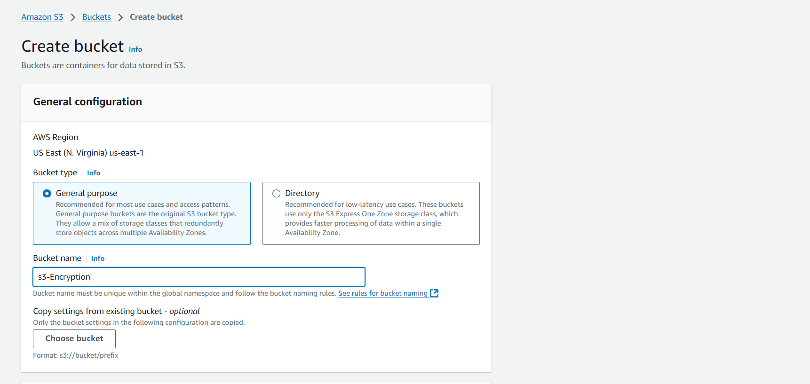
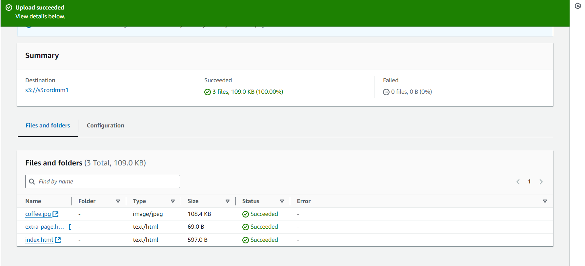
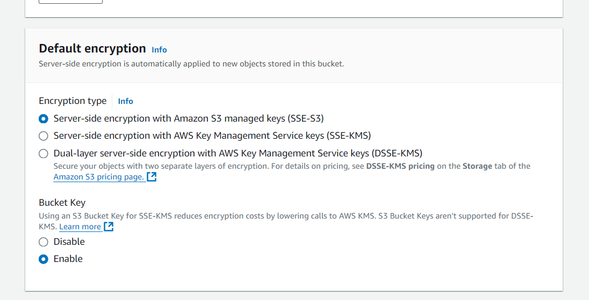
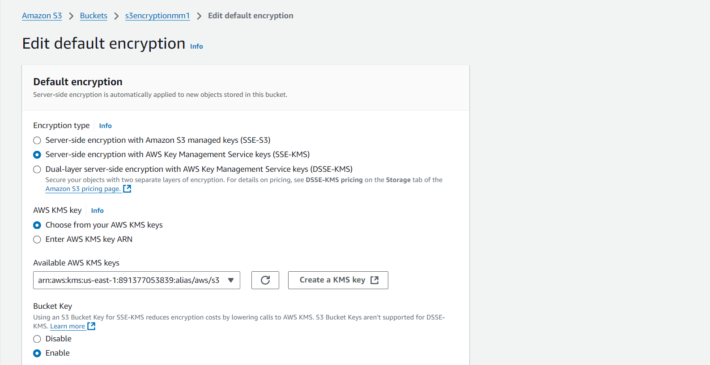

<h1>Implementing-S3-Bucket-Encryption-with-SSE-S3-and-SSE-KMS</h1>

<h2>Description</h2>
Secure data in an Amazon S3 bucket by setting up default encryption with SSE-S3 (Server-Side Encryption with Amazon S3 managed keys) and enabling selective overrides with SSE-KMS (Server-Side Encryption with AWS Key Management Service) for added security and control through AWS Key Management Service (KMS).

<br />

<h2>Deliverables: </h2>

- <b>Configured S3 bucket with enforced encryption standards.</b> 
- <b>Documentation of setup, policies, and audit logs.</b>
- <b>Optional automation to ensure compliance.</b> 

<h2>Skills Demonstrated</h2>

- <b>AWS Security Best Practices: Implementing and enforcing encryption with SSE-S3 and SSE-KMS.</b> 
- <b>AWS KMS Management: Creating and managing KMS keys, policies, and audit logging.</b>
- <b>Automation and Monitoring: Using CloudTrail and Lambda to ensure encryption compliance.(optional) </b>
- <b>Documentation and Compliance: Following security standards and documenting configurations for review. </b>

<h2>Program walk-through:</h2>

<p align="center">
creat your s3 bucket: <br/>
 
<br />
 
<br />
Add object to your s3 bucket for Encryption:  <br/>

<br />

<br />
Set Up Default Encryption: Enable SSE-S3 as the default encryption for all objects in the S3 bucket <br/>

<br />

<br />
Override with SSE-KMS: Upload objects with SSE-KMS encryption for enhanced security by specifying the KMS key:  <br/>

<br />
<br />
</p>

<!--
 ```diff
- text in red
+ text in green
! text in orange
# text in gray
@@ text in purple (and bold)@@
```
--!>
